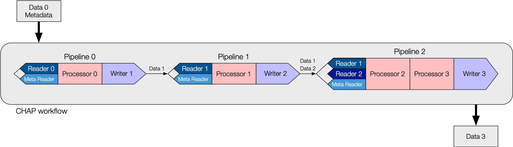

(introduction)=
# Introduction

The CHESS Analysis Pipeline (CHAP) is an object-oriented python framework for refactoring monolithic data
analysis programs into modular pipelines composed of interchangeable, reusable code components. The basic
blueprint for a `Pipeline` consists of a `Reader`, `Processor`, and `Writer`, as shown in the diagram below:

The `Reader` and `Writer` handle data input and output for the `Pipeline`. These base classes encapsulate
the CHESS-specific logistics, such as file operations and data format conversions. Inherited subclasses are
defined for specific file types, e.g. `H5Reader`, `NexusWriter`. A `Pipeline` can be constructed with
multiple `Reader`s or `Writer`s.

The `Processor` base class encapsulates the data analysis algorithm. Because `Processor`s are independent of
CHESS infrastructure, researchers who are unfamiliar with CHESS can easily contribute `Processor` subclasses
with custom code for data analysis. Data is passed into and out of a `Processor` via `PipelineData` containers.
Multiple `Processor`s can be chained together within a single `Pipeline`.

Workflows are defined by CHAP configuration files written in YAML. Each file may contain one or more
`Pipeline`s that can be executed individually or all at once (sequentially). The  diagram below shows
a schematic workflow with series of `Pipeline`s linked together in a single configuration file.

Workflows for specific X-ray techniques are constructed from concrete implementations of the CHAP base classes.
For example, in the [EDD workflow](examples/edd/annotated_pipeline.yaml),
"Pipeline 0" is for energy calibration with "Processor 0" being `MCAEnergyCalibrationProcessor`,
"Pipeline 1" is for detector theta calibration with "Processor 1" being `MCATthCalibrationProcessor`, and so on.
